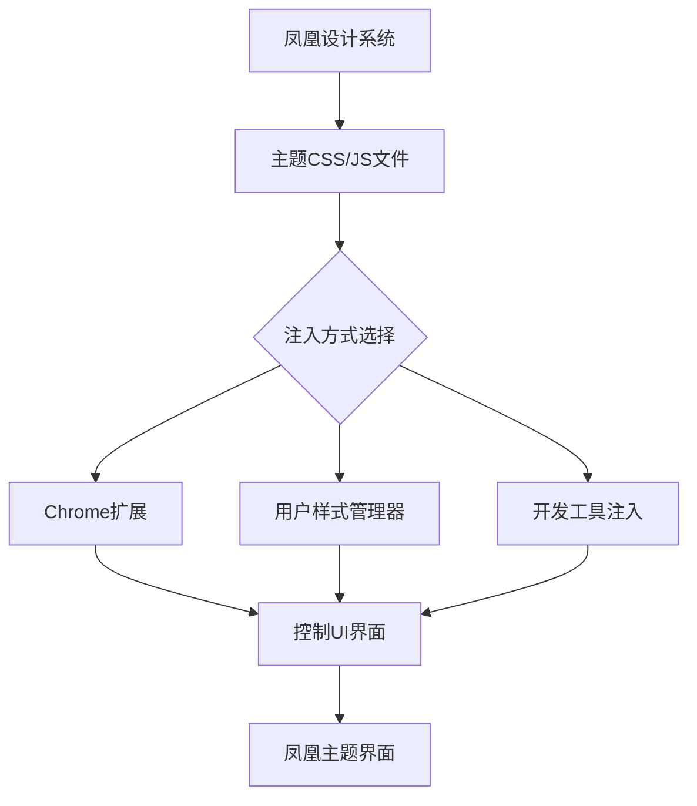

# 💉 凤凰UI注入器

为OpenClaw控制UI注入凤凰主题，实时将默认界面转换为专业的「凤凰智能体」演示界面。

## 工作原理



## 🎯 支持功能

### 核心功能
1. **主题注入**：应用凤凰配色、字体、布局
2. **动态切换**：实时切换亮色/暗色主题
3. **组件美化**：重新设计消息气泡、按钮、输入框
4. **动画增强**：添加凤凰主题的微交互动画
5. **品牌元素**：添加凤凰徽标、图标、装饰元素

### 高级功能
1. **实时编辑**：通过开发者工具实时调整设计
2. **样式热重载**：修改CSS文件自动更新界面
3. **主题保存/加载**：保存自定义主题方案
4. **组件状态监测**：监控UI组件状态变化

## 🛠️ 注入方式对比

| 方式 | 优点 | 缺点 | 适用场景 |
|------|------|------|----------|
| **Chrome扩展** | 稳定、功能强大、支持持久化 | 需要安装扩展、跨浏览器兼容性问题 | 专业演示、长期使用 |
| **用户样式管理器** | 简单、无需安装、跨平台 | 功能有限、依赖浏览器插件 | 快速测试、临时使用 |
| **开发工具注入** | 直接、灵活、无需额外工具 | 每次刷新丢失、需要手动操作 | 开发调试、快速验证 |
| **代理注入** | 完全控制、可修改网络响应 | 复杂设置、可能影响性能 | 深度定制、反向代理场景 |

## 🚀 快速开始

### 方法1：用户样式管理器（推荐初试）
1. 安装Stylus或类似用户样式管理器浏览器扩展
2. 导入以下CSS内容：
```css
/* 凤凰主题CSS */
:root {
  --phoenix-primary: #FF6B35;
  /* 完整变量定义... */
}
```

3. 应用到 `http://localhost:18789/openclaw/*`

### 方法2：开发工具注入（手动）
1. 打开控制UI界面（`http://localhost:18789/openclaw/`）
2. 按F12打开开发者工具
3. 在Console中输入：
```javascript
// 注入凤凰主题
const style = document.createElement('style');
style.textContent = `...凤凰主题CSS...`;
document.head.appendChild(style);
```

### 方法3：Chrome扩展（专业版）
1. 加载 `extensions/chrome/` 目录为解压的扩展
2. 启用扩展
3. 访问控制UI，点击扩展图标切换主题

## 📁 文件结构

```
phoenix-ui-injector/
├── extensions/chrome/          # Chrome扩展
│   ├── manifest.json
│   ├── background.js
│   ├── content.js
│   └── styles/
│       └── phoenix-theme.css
├── styles/                     # 样式文件
│   ├── phoenix-variables.css  # 设计变量
│   ├── phoenix-components.css # 组件样式
│   └── phoenix-animations.css # 动画样式
├── references/                 # 参考文档
│   ├── dom-selectors.md       # 控制UI DOM选择器
│   ├── styling-guide.md       # 样式化指南
│   └── troubleshooting.md     # 故障排除
├── scripts/                   # 工具脚本
│   ├── inject-theme.js        # 脚本注入工具
│   ├── generate-selectors.js  # 选择器生成器
│   └── monitor-changes.js     # DOM变化监控
└── assets/                    # 静态资源
    ├── phoenix-logo.svg
    ├── icons/
    └── fonts/
```

## 🔍 控制UI DOM结构分析

### 关键组件选择器
```css
/* 消息容器 */
.openclaw-messages-container { /* ... */ }

/* 输入区域 */
.openclaw-input-area { /* ... */ }

/* 会话列表 */
.openclaw-sessions-list { /* ... */ }

/* 工具栏 */
.openclaw-toolbar { /* ... */ }

/* 状态指示器 */
.openclaw-status-indicator { /* ... */ }
```

### 消息元素结构
```html
<div class="message" data-role="assistant">
  <div class="message-content">
    <div class="message-text">...</div>
  </div>
</div>
```

### 注入点策略
1. **优先级注入**：使用 `!important` 确保覆盖默认样式
2. **渐进增强**：先注入变量，再注入组件样式
3. **状态管理**：监控DOM变化，动态应用样式

## 🧰 开发工具脚本

### 自动注入脚本
```javascript
// references/inject-theme.js
const PHOENIX_THEME = {
  version: '1.0.0',
  css: `/* 凤凰主题CSS */`,
  apply: function() {
    // 应用主题逻辑
  }
};
```

### DOM选择器生成器
```javascript
// references/generate-selectors.js
// 自动分析控制UI，生成CSS选择器映射
```

## 🎨 主题配置

### 配置选项
```json
{
  "theme": {
    "mode": "dark",
    "primaryColor": "#FF6B35",
    "secondaryColor": "#1A1A2E",
    "fontFamily": "-apple-system, sans-serif",
    "animations": true,
    "branding": {
      "logo": true,
      "favicon": true,
      "titlePrefix": "Fhoenix"
    }
  }
}
```

### 主题切换
```javascript
const themes = {
  light: { /* 亮色主题配置 */ },
  dark: { /* 暗色主题配置 */ },
  business: { /* 商务主题配置 */ },
  creative: { /* 创意主题配置 */ }
};
```

## 🚨 故障排除

### 常见问题
1. **样式未应用**
   - 检查选择器是否正确
   - 确认注入时机（DOM是否已加载）
   - 检查CSS优先级

2. **布局错乱**
   - 检查CSS属性冲突
   - 验证盒模型计算
   - 检查响应式布局断点

3. **动画卡顿**
   - 优化CSS动画性能
   - 减少重绘和重排
   - 使用transform和opacity属性

### 调试工具
```javascript
// 启用调试模式
window.PHOENIX_THEME_DEBUG = true;
```

## 📊 性能考虑

### CSS优化
- 合并CSS文件，减少HTTP请求
- 压缩CSS，移除未使用的样式
- 使用CSS变量，减少重复声明
- 避免深层嵌套选择器

### 注入优化
- 延迟非关键样式加载
- 按需注入组件样式
- 缓存样式计算

## 🔄 更新维护

### 版本兼容性
| 主题版本 | OpenClaw版本 | 备注 |
|----------|--------------|------|
| v1.0.x | >= 2026.3.0 | 基础样式注入 |
| v1.1.x | >= 2026.3.5 | 增强组件支持 |
| v2.0.x | >= 2026.4.0 | 完整主题系统 |

### 升级指南
1. 备份当前主题配置
2. 测试新版本兼容性
3. 逐步应用变更
4. 验证功能完整性

## 📞 技术支持

### 社区支持
- 问题报告：创建GitHub Issue
- 功能请求：提交功能建议
- 贡献指南：查看CONTRIBUTING.md

### 紧急修复
对于关键问题，可用紧急修复脚本：
```bash
node scripts/emergency-fix.js
```

## 🔮 未来规划

### 短期目标
- [ ] 完成Chrome扩展开发
- [ ] 支持Firefox扩展
- [ ] 添加主题编辑器
- [ ] 开发主题市场

### 长期愿景
- [ ] 支持多智能体主题
- [ ] 实现AI驱动的动态主题
- [ ] 集成设计系统工具链
- [ ] 支持第三方主题开发

---

**核心价值**：让Fhoenix在视觉上展现其「凤凰」品牌人格，增强演示冲击力和专业感，同时提供灵活、稳定的主题化解决方案。